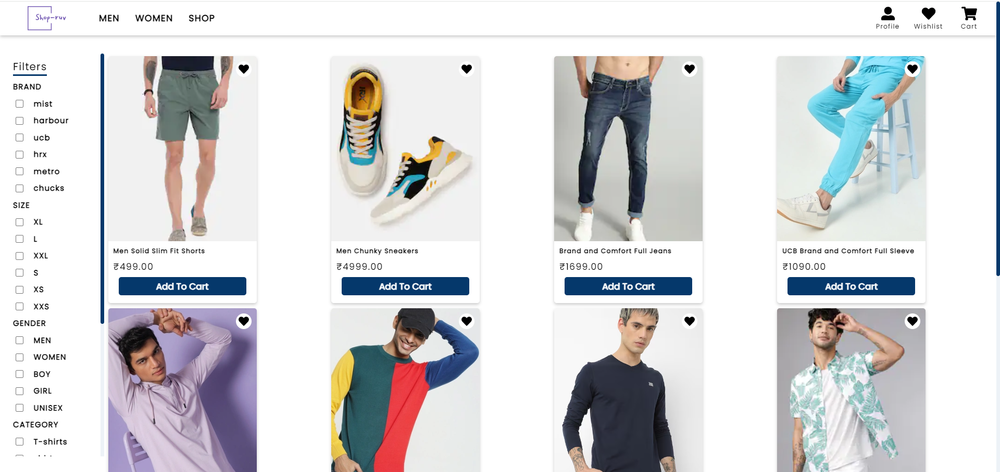

# [Shopruv - Ecommerce Platform](https://shopruv.vercel.app/)
A E-commerce store to style your wardrobe providing a seamless online shopping experience.

## Features

- User will able to create own accounts.
- Can add products to wishlist & cart.
- Details about each product.
- Filter the products.
- Order the desired product from cart.
- Integrated Razorpay as a payment gateway, ensuring secure transaction.

## Tech Stack

-  Django
-  Django-Rest-Framework
-  SQL-lite
-  React.js
-  Context-api
-  Css

Backend Repository- [Django-React-Store](https://github.com/dhruvsolanki0811/Django-React-Store)
